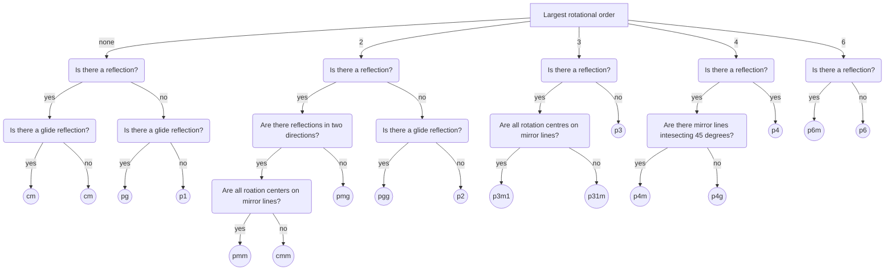

# Tilling Presentation

## Description
This repository contains a presentation on tilling, specifically focusing on periodic to aperiodic tilling.

## Content
- `presentation.pdf`: The main presentation file.
- `presentation.tex`: The LaTeX source code for the presentation.
- `presentation.bib`: The bibliography file for the presentation.
- `diagrams/`: A directory containing all the tikz diagrams.

## Resources
https://www.aperiodictiling.org/wpaperiodictiling/index.php/2x2-supertiles/large-supertiles/

### Mermaid diagram of wallpaper groups classification

### TeX Overflow
- https://tex.stackexchange.com/questions/61437/penrose-tiling-in-tikz

### Code
- https://github.com/loopspace/tilings
